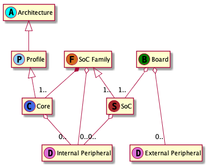
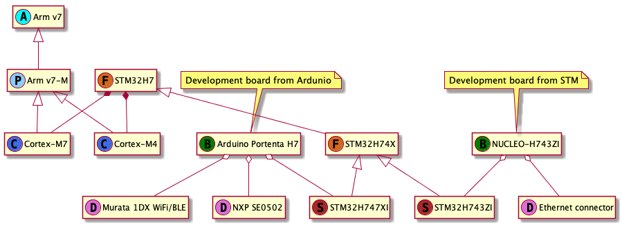

# Standard platform BSP using CMSIS-Pack

## Table of contents

- [Standard platform BSP using CMSIS-Pack](#standard-platform-bsp-using-cmsis-pack)
  - [Table of contents](#table-of-contents)
  - [Revision history](#revision-history)
  - [ToDo (temp)](#todo-temp)
  - [Introduction](#introduction)
    - [Overview and background](#overview-and-background)
    - [Current state](#current-state)
    - [Requirements and assumptions](#requirements-and-assumptions)
      - [Hardware hierarchy](#hardware-hierarchy)
      - [Standard vs custom hardware](#standard-vs-custom-hardware)
      - [Hardware porting and abstraction layer](#hardware-porting-and-abstraction-layer)
      - [HW porting](#hw-porting)
      - [BSP structure and distribution](#bsp-structure-and-distribution)
- [System architecture and high-level design](#system-architecture-and-high-level-design)
- [Detailed design](#detailed-design)
- [Tools and configuration changes](#tools-and-configuration-changes)
- [Contributors](#contributors)

## Revision history

0.1 - Initial thoughts based on various prior conversation and reflections - Bartek Szatkowski <bartek.szatkowski@arm.com> - 9.01.2020

## ToDo (temp)

* Finish introduction and architecture of proposed solution
* Seek review
* Work with teams on detailed design
* Think where's the line between overview/requirements and a solution. Move things accordingly. 

## Introduction

Board support package (BSP) can be defined as many different things depending on context or purpose, in this document I'll focus exclusively on the IoT use cases.

### Overview and background

BSP provides all the software components and configuration necessary to boot the hardware, run the OS and user application. This can include:

* Hardware description
* SOC configuration (clocks, pin out, etc)
* Memory map (linker file and configuration)
* Low level hardware setup and platform bootstrap
* Peripheral drivers
* Libraries
* Other drivers (eg. comms stack)
* Docs/examples/other

Platform support, even for small embedded systems, is a huge topic and can't be defined in one design document. This document will introduce various concepts and look at defining structure and requirements for platform BSP. Each of its components will be at least outlined, but the details won't be specified here. Detailed design documents may follow where needed.

### Current state

In Mbed OS the concept of BSP is synonymous with a development board support. Although abstraction for SOC family and SOC can be created, they are primarily used to enable standard development boards. Modules and custom hardware support is possible, but it's an afterthought and it's not well supported.

For all levels of hardware support the integration process, requirement and interfaces are not very well defined. Although Mbed OS provides a hardware abstraction layer (HAL) its scope is limited to peripheral drivers. Partners and users wishing to port their hardware to Mbed OS have to mostly rely on examples of already integrated platforms and extensively use help from Mbed team. There's no clear definition or interface for platform bootstrap.

Mbed OS doesn't treat custom hardware support in any special way, except providing an option to overlay external, out of tree, board support. There's no clean and generic way of bundling and configuring additional drivers (eg. For comms stacks). It's unclear how user should progress from defining SOC configuration using silicon vendor tools (like STM CubeMX) to board port that can be integrated with Mbed OS.

Situation is very similar across other OSes and frameworks. A silicon vendor wishing to enable their hardware needs to repeat the process for each and every software stack. There's no standards or solutions that would significantly reduce the work required.

### Requirements and assumptions

Hardware support is critical part of any software system. Well defined and generic, but simple integration layer is key to enabling rich varieties of existing and future hardware platforms. It also improves overall quality by code reuse and improving testability of well defined integration surfaces. I'm using terms software stack and OS interchangeably in this document. At the same time the whole concept I'm describing is still valid for bare metal uses, where application can be developed directly on the APIs exposed by and benefit from all the advantages of the standard BSP.
We'll look into couple of different challenges connected to hardware integration in the following points.

#### Hardware hierarchy

Looking at the hardware available on the market and using past customer and partner interactions we can distinguish multiple levels of hardware targets integration:

* Processor architecture - Current scope limited to Arm. Supported mainly through CMSIS-Core and toolchain integration.
* Architecture profile or family - Mbed OS is focused on Cortex-M processors, but there's a limited support for Cortex-A. Supported mainly through CMSIS-Core and toolchain integration
* Core - Specific implementation of architecture and profile, eg. Cortex-M4. Supported mainly through CMSIS-Core and toolchain integration.
* SoC family - Collection of related system-on-chip designs from a vendor. It can be built on one or more MCU cores, which don't need to be of the same type or even architecture. Will typically include multiple peripheral hardware blocks. Support added by the vendor.
* SoC - A physical chip, contains one or more MCU cores, buses, various memories, timers, caches and other peripherals. Will typically include multiple peripheral hardware blocks. It may come in multiple variants with different features or memory sizes. Support added by the vendor.
* Peripheral - They are not part of the hierarchy outlined above, but they are important SoC building blocks. A peripheral would be any piece of additional hardware that provides some functionality and requires software driver or configuration. We can divide the peripherals in two groups:
  *  internal - built into the core, SoC family or SoC. Common examples include MPU, timers, GPIO, SPI, I2C.
  *  external - placed on a separate die included into a board design. Common examples include external flash, connectivity modules, GPS or secure element.
  In principle there's not much differences between the two groups and a lot of the peripherals could be implemented in both ways. The division is still useful to illustrate where the hardware block fits into the overall design and what implication on the overall system it may have. External peripherals are often more complicated and would require using one of the internal peripheral to access them.
* Board - From the OS point of view it's a usable physical hardware, it can be either development board or a final product. A board is a collection of one or more SoCs and zero or more external peripherals. Development boards would be supported by their vendor, custom designs would usually live outside of the OS tree.

The hierarchy described above can be approximated using UML class diagram:

 

Worth adding that the OS support for hardware should be quite flexible and the above diagram is a generic illustration rather than a strict requirement. Different silicon vendors may choose to define their designs as family of SoCs, SoCs or mix of both. They may define deeper network of inheritance or fold it down into simple hierarchy with extended configuration. There is no one correct way, the optimal choice is hardware dependent and will be influenced by the hardware, tools and processes guiding their development.

Below is a simplified example illustrating one of the existing hardware targets:

Another important aspect that's missing from the above discussion and diagrams is execution mode. This can be be defined a a separate software images or configurations executed on a single physical core. The main use case is PSA where on v8 architecture execution of secure and non-secure images is interleaved on one MCU. Also the coexistence of main application and a bootloder can be expressed in similar terms. My current thinking is that we can express this concept without creating separate class of HW components by conceptually virtualizing the core. This may need to be changed if during the detailed requirement definition we observe any incompatibilities.

#### Standard vs custom hardware

By standard hardware I mean a generic purpose SoC or a board that is available on the market for 3rd parties for purchase. It can be used either for development purposes or to base derivative designs on it. It's designed to be quite flexible and meant for wide number of use-cases.
In turn, custom hardware is designed with and optimized to a specific use case. Usually it's meant to be embedded in a final product. The hardware and BSP for it may not be publicly available.

From the standards and structure point of view there's not difference between a BSP for a standard and custom hardware. They should follow the same integration scheme and adhere to the same requirements. The main difference is with the targeted audience and distribution mechanisms. Standard hardware is targeting general audience (community and customers) and this should be reflected by the quality of documentation and available APIs and other resources. Custom hardware on the other hand usually targets smaller set of people, often internal to a specific product team, available resources may focus on their unique needs.

While standard hardware will usually live in or be closely associated with the OS, custom hardware won't be usually considered for upstreaming.

#### Hardware porting and abstraction layer

Good hardware integration is a foundation for a solid operating system. Due to wide range of available hardware platforms and a high degree of differentiation between designs, that problem of hardware integration is a difficult one.

In Arm ecosystem parts of the abstraction definitions and porting process are already done for us. The Arm architecture, CMSIS-Core, toolchain and standard C library support provide a solid, well defined interface that we have to leveraged in the OS.

We can distinguish two broad categories of secondary integration:

* Bootstrap abstraction layer (BAL) - all the code and configuration needed for the platform to boot and start executing the OS or the application code. This doesn't need to be a separate "thing", but can be defined as part of HAL, I'm calling it out here as it's often overlooked.
* Hardware abstraction layer (HAL) - common interface for accessing various peripherals.

For both BAL and HAL we need to clearly state that we won't be able to support all the hardware features in a generic and simple set of APIs. We should also acknowledge that it is important to allow the hardware vendors to differentiate and the users to use all the features of the hardware platform. The only way of achieving this without a nightmare of infinite fragmentation is to provide a solid base APIs that abstracts out the common, standard functionality. It doesn't mean that there is to be no differences at this level, but that the existing differences must be mapped onto proposed APIs. At the same time we have to provide a mechanism for vendors to implement extensions that expose their specific hardware features without destroying the look and feel of the OS or introducing uncontrolled fragmentation.

#### HW porting

For both custom and standard hardware the porting process will look very similar. Most of the differences are during the initial hardware bringup, before the porting of the OS, which is hardware and vendor specific.

The basic requirement for the OS bringup is that hardware is able to boot and execute arbitrary code. This is usually achieved by downloading or generating a basic vendor support package. Vendors usually make their BSP available for standard development boards and provide software that can generate them for custom hardware.

This document won't go into details of generating vendor specific support package. Instead it'll identify and define required artefact and specify the structure in which they should be packaged. We'll engage with silicon vendors to enable their tools to export the basic BSP to the defined format. Short term we should also consider building a tool that can accept different formats as produced by vendor tools and transform them to standard format and structure.

#### BSP structure and distribution

OS hardware support should reuse as many existing components as possible. Tapping into the existing ecosystem of platform support and tools would be ideal.

[CMSIS-Pack](https://arm-software.github.io/CMSIS_5/Pack/html/index.html) is a standard of defining and distributing software components, as well as a vast repository of existing software packages. Currently this repository contain many vendor BSP packs, unfortunately there's no defined standard for them, therefore they differ vastly and don't provide unified integration layer.

The CMSIS-Pack standard is flexible enough to be used to package and distribute any software components and also express dependencies between them...

# System architecture and high-level design

# Detailed design

# Tools and configuration changes

# Contributors

Graham Hammond, Sophie Williams, Bartek Szatkowski, Arek Załuski